# BM25 Keyword Matching

This document explains how Concept-RAG uses BM25 (Best Matching 25) to provide keyword-based search relevance alongside semantic vector search.

---

## What is BM25?

**BM25** is a probabilistic ranking function widely used in information retrieval systems. It scores documents based on:

- **Term Frequency (TF)**: How often search terms appear in the document
- **Document Length Normalization**: Adjusts for longer documents
- **Term Saturation**: Diminishing returns for repeated terms

BM25 is the algorithm behind major search engines and is considered the gold standard for keyword matching.

---

## Why BM25?

Vector search excels at semantic similarity but can miss exact keyword matches. Consider:

| Query | Vector Search | BM25 |
|-------|---------------|------|
| "Distributed Systems" | Finds "parallel computing", "concurrent systems" | Finds exact phrase matches |
| "API security" | Finds "authentication", "access control" | Finds documents with "API" and "security" |

**The problem:** Pure vector search found only 2 of 4 books with "Distributed Systems" in their titles.

**The solution:** BM25 ensures exact keyword matches rank highly, complementing semantic understanding.

---

## How It Works

### The BM25 Formula

```mermaid
flowchart LR
    subgraph Input["🔍 Query Terms"]
        Terms["distributed, systems"]
    end

    subgraph Scoring["📊 BM25 Scoring"]
        TF["Term Frequency<br/>How often in doc?"]
        DL["Document Length<br/>Normalize for size"]
        K1["k1 = 1.5<br/>Saturation control"]
        B["b = 0.75<br/>Length normalization"]
    end

    subgraph Output["📋 BM25 Score"]
        Score["0.0 - 1.0<br/>Normalized relevance"]
    end

    Terms --> TF
    TF --> DL
    DL --> Score
    K1 -.-> DL
    B -.-> DL
```



**Core formula:**

```
BM25(term) = TF × (k1 + 1) / (TF + k1 × (1 - b + b × docLength/avgDocLength))
```

Where:
- **TF** = term frequency in document
- **k1** = 1.5 (controls term frequency saturation)
- **b** = 0.75 (controls document length normalization)

### Match Types

Concept-RAG's BM25 implementation supports graduated matching:

| Match Type | Weight | Example |
|------------|--------|---------|
| **Exact match** | 1.0 | "war" matches "war" |
| **Prefix match** | 0.5 | "war" matches "warfare" |
| **Substring match** | 0.25 | "algorithm" matches "bioalgorithm" |

This allows for flexible matching while prioritizing exact terms.

### Term Weighting

When queries are expanded (via WordNet or concepts), expanded terms receive lower weights:


---

## Integration in Hybrid Search

BM25 is one of four signals in the hybrid ranking system:


### Weight Distribution by Search Type

| Search Type | Vector | BM25 | Concept | WordNet | Title |
|-------------|--------|------|---------|---------|-------|
| Chunk Search | 35% | 30% | 20% | 15% | — |
| Catalog Search | 30% | 25% | 15% | 10% | 20% |
| Concept Search | 30% | 20% | — | 10% | 40% |

---

## Scoring Details

### Normalization

BM25 scores are normalized to 0.0–1.0 range by combining:

1. **Raw BM25 score** (normalized by expected maximum per term)
2. **Term coverage** (fraction of query terms found)

```
finalScore = (normalizedRaw × 0.5) + (termCoverage × 0.5)
```

This rewards documents that match **more** query terms, not just documents with high frequency of fewer terms.

### Example Scoring

Query: "distributed systems consensus"

| Document | Terms Found | Term Coverage | BM25 Raw | Final Score |
|----------|-------------|---------------|----------|-------------|
| Doc A | all 3 | 1.0 | 0.8 | 0.9 |
| Doc B | 2 of 3 | 0.67 | 0.9 | 0.78 |
| Doc C | 1 of 3 | 0.33 | 1.0 | 0.67 |

---

## Value Added to Search

### Before vs. After Hybrid Search

| Metric | Vector Only | With BM25 | Improvement |
|--------|-------------|-----------|-------------|
| Title matching | 50% (2/4 books) | 100% (4/4 books) | **2x better** |
| Keyword precision | Low | High | Significant |
| Exact phrase matches | Unreliable | Reliable | Consistent |

### Complementary Strengths

| Scenario | Vector Search | BM25 |
|----------|---------------|------|
| Semantic similarity | ✅ Strong | ❌ Weak |
| Exact keywords | ❌ Weak | ✅ Strong |
| Synonyms | ✅ Handles | ❌ Misses |
| Rare technical terms | ❌ May miss | ✅ Finds |
| Typos/variants | ❌ Misses | ❌ Misses |

Combined, they provide **best-of-both-worlds** search capability.

---

## Technical Implementation

### Parameters

```typescript
const k1 = 1.5;  // Term frequency saturation
const b = 0.75;  // Document length normalization
const avgDocLength = 100;  // Approximate average document length
```

**Parameter effects:**
- Higher **k1** → More sensitivity to term frequency
- Higher **b** → Stronger length normalization (favors shorter docs)

### Score Clamping

All scores are clamped to valid ranges:

```typescript
return Math.min(Math.max(finalScore, 0), 1.0);
```

### Text Processing

Before scoring, text is:
1. Lowercased for case-insensitive matching
2. Tokenized by splitting on whitespace and punctuation
3. Filtered to remove empty tokens

```typescript
const docWords = combinedText
  .split(/[\s.,;:!?()[\]{}'"]+/)
  .filter(w => w.length > 0);
```

---

## Why Not Pure BM25?

While BM25 excels at keyword matching, using it alone would lose:

- **Semantic understanding**: "distributed systems" ≠ "parallel computing"
- **Concept matching**: Domain-specific term relationships
- **Synonym handling**: "approach" ≠ "strategy"

The hybrid approach preserves these benefits while adding keyword precision.

---

## Related Documentation

- [ADR-0006: Hybrid Search Strategy](adr0006-hybrid-search-strategy.md) — Design decision
- [WordNet Enrichment](wordnet-enrichment.md) — Synonym expansion
- [ADR-0010: Query Expansion](adr0010-query-expansion.md) — Term weighting

