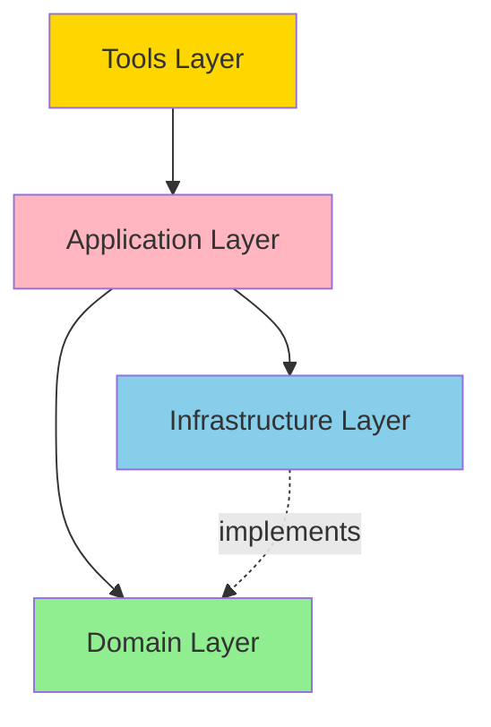

# Architecture Documentation Plan

**Date:** 2025-11-20  
**Priority:** LOW (Phase 3, Week 5)  
**Status:** Planning

## Overview

Establish a systematic approach to documenting architectural decisions and design rationale through Architectural Decision Records (ADRs). This will preserve institutional knowledge, provide context for future maintainers, and facilitate informed decision-making.

## Knowledge Base Insights Applied

### Core Documentation Principles

**From Software Engineering and Architecture sources:**

1. **Document Decisions, Not Just Code**
   - Capture the "why" behind choices
   - Preserve context that led to decisions
   - Document alternatives considered

2. **Lightweight Documentation**
   - Keep documentation close to code
   - Use simple, consistent format
   - Make documentation easy to write and maintain

3. **Version Control for Decisions**
   - Track decision evolution
   - Link decisions to code changes
   - Enable decision review and reversal

4. **Architecture as Communication**
   - Make implicit design explicit
   - Share mental models
   - Enable informed refactoring

## ADR Format and Structure

### Standard ADR Template

```markdown
# [Number]. [Title]

**Date:** YYYY-MM-DD  
**Status:** [Proposed | Accepted | Deprecated | Superseded by ADR-XXX]  
**Deciders:** [Names or roles of people who made the decision]  
**Technical Story:** [Optional: Link to issue, PR, or discussion]

## Context and Problem Statement

[Describe the context and the problem that needs a decision. What forces are at play? What constraints exist?]

## Decision Drivers

* [driver 1, e.g., business requirement]
* [driver 2, e.g., technical constraint]
* [driver 3, e.g., team experience]
* [etc.]

## Considered Options

* [option 1]
* [option 2]
* [option 3]
* [etc.]

## Decision Outcome

**Chosen option:** "[option X]", because [justification].

### Consequences

**Positive:**
* [e.g., improvement of quality attribute satisfaction]
* [etc.]

**Negative:**
* [e.g., compromising quality attribute]
* [etc.]

**Neutral:**
* [e.g., architectural style decision]
* [etc.]

### Confirmation

[How will we know if this decision was right? What metrics or observations will validate it?]

## Pros and Cons of the Options

### [option 1]

[Description of option 1]

**Pros:**
* [argument a]
* [argument b]

**Cons:**
* [argument a]
* [argument b]

### [option 2]

[Description of option 2]

**Pros:**
* [argument a]
* [argument b]

**Cons:**
* [argument a]
* [argument b]

## More Information

[Optional: Links to related resources, discussions, or implementation details]
```

## Initial ADRs to Document

### ADR-001: Layered Architecture

**Purpose:** Document the decision to use a layered architecture pattern

**Key Points:**
- Why: Separation of concerns, testability, maintainability
- Alternatives: Hexagonal, Clean Architecture variants, Microservices
- Decision: Four layers (domain, infrastructure, application, tools)
- Consequences: Clear boundaries, dependency inversion required

### ADR-002: Dependency Injection Container

**Purpose:** Document choice of DI pattern and implementation

**Key Points:**
- Why: Testability, loose coupling, configuration flexibility
- Alternatives: Manual wiring, service locator, framework DI
- Decision: Custom lightweight container in application layer
- Consequences: No external DI framework dependency, full control

### ADR-003: LanceDB for Vector Storage

**Purpose:** Document database choice for vector embeddings

**Key Points:**
- Why: Embedded database, TypeScript support, performance
- Alternatives: Pinecone, Qdrant, ChromaDB, PostgreSQL with pgvector
- Decision: LanceDB for embedded deployment
- Consequences: Local-first, no external service dependencies

### ADR-004: Hybrid Search Strategy

**Purpose:** Document the multi-signal search approach

**Key Points:**
- Why: Better relevance than single-method search
- Alternatives: Vector-only, BM25-only, semantic search only
- Decision: Combine vector + BM25 + concept scoring
- Consequences: More complex, better results, tuning required

### ADR-005: MCP Tools Interface

**Purpose:** Document API design for AI agent integration

**Key Points:**
- Why: Standard protocol for AI agent interaction
- Alternatives: REST API, GraphQL, custom RPC
- Decision: MCP (Model Context Protocol) tools
- Consequences: AI-first interface, streaming support, standardized

### ADR-006: TypeScript with Strict Mode

**Purpose:** Document language and type system choices

**Key Points:**
- Why: Type safety, tooling, maintainability
- Alternatives: JavaScript, TypeScript non-strict, other languages
- Decision: TypeScript with strict mode enabled
- Consequences: Compile-time type checking, some development overhead

### ADR-007: Vitest for Testing

**Purpose:** Document testing framework choice

**Key Points:**
- Why: Fast, native ESM support, Vite compatibility
- Alternatives: Jest, Mocha/Chai, Node test runner
- Decision: Vitest for all test types
- Consequences: Modern tooling, good DX, smaller ecosystem

### ADR-008: Repository Pattern for Data Access

**Purpose:** Document data access abstraction pattern

**Key Points:**
- Why: Testability, swap implementations, clear interface
- Alternatives: Direct database access, DAO pattern, Active Record
- Decision: Repository pattern with interfaces
- Consequences: Extra abstraction layer, easier testing

### ADR-009: Concept Extraction Strategy

**Purpose:** Document approach to extracting semantic concepts

**Key Points:**
- Why: Enhanced search relevance, semantic organization
- Alternatives: Keyword extraction, manual tagging, full AI generation
- Decision: Hybrid approach with AI assistance and post-processing
- Consequences: Richer metadata, extraction cost, quality variability

### ADR-010: Multi-Provider Embedding Support

**Purpose:** Document support for multiple embedding providers

**Key Points:**
- Why: Flexibility, cost optimization, avoid vendor lock-in
- Alternatives: Single provider, bring-your-own embeddings
- Decision: Support OpenAI, Voyage AI, Ollama via adapter pattern
- Consequences: More complex configuration, flexibility for users

## ADR Storage and Organization

### Directory Structure

```
docs/
├── architecture/
│   ├── README.md                    # Overview and index
│   ├── decisions/                   # ADRs
│   │   ├── 0001-layered-architecture.md
│   │   ├── 0002-dependency-injection.md
│   │   ├── 0003-lancedb-vector-storage.md
│   │   ├── 0004-hybrid-search-strategy.md
│   │   ├── 0005-mcp-tools-interface.md
│   │   ├── 0006-typescript-strict-mode.md
│   │   ├── 0007-vitest-testing.md
│   │   ├── 0008-repository-pattern.md
│   │   ├── 0009-concept-extraction.md
│   │   ├── 0010-multi-provider-embeddings.md
│   │   └── template.md              # ADR template
│   ├── diagrams/                    # Architecture diagrams
│   │   ├── system-overview.mmd
│   │   ├── layered-architecture.mmd
│   │   └── search-flow.mmd
│   └── patterns/                    # Design patterns used
│       ├── repository-pattern.md
│       ├── factory-pattern.md
│       └── decorator-pattern.md
```

### ADR Naming Convention

- Format: `[number]-[kebab-case-title].md`
- Examples:
  - `0001-layered-architecture.md`
  - `0002-dependency-injection.md`
  - `0015-caching-strategy.md`

### ADR Numbering

- Zero-padded four digits (0001, 0002, etc.)
- Sequential numbering
- Numbers never reused (even if ADR superseded)

## ADR Workflow

### Creating a New ADR

1. **Identify Decision Point**
   - Significant architectural choice
   - Impact on multiple components
   - Long-term consequences

2. **Copy Template**
   ```bash
   cp docs/architecture/decisions/template.md \
      docs/architecture/decisions/00XX-new-decision.md
   ```

3. **Fill Out Sections**
   - Context: What problem needs solving?
   - Options: What alternatives exist?
   - Decision: What did we choose?
   - Rationale: Why this option?
   - Consequences: What are the trade-offs?

4. **Review with Team**
   - Share for feedback
   - Discuss alternatives
   - Refine based on input

5. **Accept and Commit**
   - Change status to "Accepted"
   - Commit to repository
   - Link from README

### Updating an ADR

ADRs are immutable once accepted. To change a decision:

1. **Create New ADR**
   - Document new decision
   - Reference old ADR

2. **Update Old ADR**
   - Change status to "Superseded by ADR-XXX"
   - Leave content intact (historical record)

3. **Update Index**
   - Mark old ADR as superseded
   - Add new ADR

### Deprecating an ADR

If decision is reversed without replacement:

1. Change status to "Deprecated"
2. Add deprecation note explaining why
3. Link to discussion or issue

## Supporting Documentation

### Architecture Overview

```markdown
# Architecture Overview

## System Purpose

Concept-RAG is a semantic document search system that enables AI agents to search and retrieve information from personal knowledge bases using natural language queries.

## Key Design Principles

1. **Layered Architecture**: Clear separation between domain, infrastructure, application, and tools
2. **Dependency Inversion**: High-level modules depend on abstractions, not implementations
3. **Interface-Based Design**: All major components interact through defined interfaces
4. **Testability First**: Architecture designed to facilitate testing at all levels
5. **AI-First API**: MCP tools provide standardized interface for AI agents

## Architecture Layers

### Domain Layer
- **Purpose**: Core business logic and domain models
- **Components**: Services, entities, value objects, interfaces
- **Dependencies**: None (pure domain logic)

### Infrastructure Layer
- **Purpose**: External system adapters
- **Components**: Databases, embedding providers, document loaders
- **Dependencies**: Domain interfaces

### Application Layer
- **Purpose**: Application coordination and configuration
- **Components**: DI container, configuration, bootstrapping
- **Dependencies**: Domain and infrastructure

### Tools Layer
- **Purpose**: MCP tool implementations
- **Components**: Tool handlers, parameter validation
- **Dependencies**: Application services

## Key Design Patterns

- **Repository Pattern**: Abstract data access
- **Factory Pattern**: Create complex objects
- **Decorator Pattern**: Add cross-cutting concerns
- **Strategy Pattern**: Algorithm selection (embedding providers)
- **Adapter Pattern**: Integrate external systems

## Quality Attributes

- **Maintainability**: Clear structure, good separation
- **Testability**: Interface-based design, DI
- **Extensibility**: Easy to add new providers, loaders
- **Performance**: Caching, efficient search
- **Reliability**: Error handling, validation

## Technology Stack

- **Language**: TypeScript (strict mode)
- **Runtime**: Node.js
- **Database**: LanceDB (vector), SQLite (metadata)
- **Testing**: Vitest
- **Embeddings**: OpenAI, Voyage AI, Ollama
- **Protocol**: MCP (Model Context Protocol)
```

### Mermaid Diagrams



## Implementation Tasks

### Task 6.1: Set Up ADR Infrastructure (2 hours)

**Subtasks:**
1. Create directory structure (30m)
2. Create ADR template (30m)
3. Create architecture README (1h)

**Files to Create:**
- `docs/architecture/README.md`
- `docs/architecture/decisions/template.md`
- `.adr-tools` config (optional)

### Task 6.2: Document Initial ADRs (4 hours)

**Subtasks:**
1. Document architectural decisions (ADRs 1-5) (2h)
2. Document technology choices (ADRs 6-7) (1h)
3. Document pattern decisions (ADRs 8-10) (1h)

**Files to Create:**
- `docs/architecture/decisions/0001-layered-architecture.md`
- `docs/architecture/decisions/0002-dependency-injection.md`
- (and 8 more ADRs)

### Task 6.3: Create Architecture Overview (2 hours)

**Subtasks:**
1. Write architecture overview document (1h)
2. Create Mermaid diagrams (1h)

**Files to Create:**
- `docs/architecture/overview.md`
- `docs/architecture/diagrams/system-overview.mmd`
- `docs/architecture/diagrams/layered-architecture.mmd`

### Task 6.4: Document Design Patterns (2 hours)

**Subtasks:**
1. Document repository pattern usage (40m)
2. Document factory pattern usage (40m)
3. Document other patterns (40m)

**Files to Create:**
- `docs/architecture/patterns/repository-pattern.md`
- `docs/architecture/patterns/factory-pattern.md`
- `docs/architecture/patterns/decorator-pattern.md`

## Tools and Automation

### ADR Tools (Optional)

```bash
# Install adr-tools
npm install -g adr-log

# Create new ADR
adr new "Use TypeScript for implementation"

# Generate ADR table of contents
adr generate toc > docs/architecture/decisions/README.md

# Create status badges
adr generate graph > docs/architecture/decisions/graph.svg
```

### VS Code Extension

- **Extension**: "ADR Manager" or "Architecture Decision Records"
- **Features**: Templates, navigation, status management

## Success Criteria

- [ ] ADR infrastructure created
- [ ] Template documented and accessible
- [ ] Minimum 10 initial ADRs documented
- [ ] Architecture overview written
- [ ] Architecture diagrams created
- [ ] Design patterns documented
- [ ] ADR index maintained
- [ ] Team trained on ADR process

## ADR Review Checklist

When reviewing an ADR:

- [ ] Context clearly describes the problem
- [ ] Decision drivers are explicit
- [ ] Multiple options were considered
- [ ] Chosen option has clear justification
- [ ] Consequences (positive and negative) identified
- [ ] Status is appropriate
- [ ] Related ADRs are linked
- [ ] Grammar and spelling are correct

## Maintenance

### Regular Review

- **Quarterly**: Review all "Proposed" ADRs
- **Annually**: Review all "Accepted" ADRs for relevance
- **Per Major Change**: Create new ADR or supersede existing

### Linking ADRs

- Link from code comments to relevant ADRs
- Link from ADRs to implementation (files, PRs)
- Link superseding ADRs to superseded ones

## Example ADR

```markdown
# 4. Hybrid Search Strategy

**Date:** 2025-11-20  
**Status:** Accepted  
**Deciders:** Engineering Team  
**Technical Story:** Initial architecture design

## Context and Problem Statement

Users need highly relevant search results from their document collection. Single-method search (e.g., only vector search or only keyword search) often misses important results because:

- Vector search may miss exact term matches
- Keyword search may miss semantic similarity
- Neither captures concept-level understanding

How can we provide the most relevant search results?

## Decision Drivers

* User requirement for high-quality search results
* Need to balance precision and recall
* Existing research showing hybrid approaches outperform single methods
* Available vector database and indexing infrastructure
* Concept extraction capability unique to our system

## Considered Options

* Vector search only
* BM25 keyword search only
* Vector + BM25 hybrid
* Vector + BM25 + concept scoring (chosen)
* Neural ranking models

## Decision Outcome

**Chosen option:** "Vector + BM25 + concept scoring", because it combines the strengths of multiple approaches while leveraging our unique concept extraction capability.

### Consequences

**Positive:**
* Better search relevance than single-method approaches
* Leverages our concept extraction work
* Allows tuning of different signals
* Falls back gracefully if one method fails

**Negative:**
* More complex implementation
* Requires careful score normalization
* More expensive computationally
* Harder to debug and tune

**Neutral:**
* Need to determine optimal score weighting
* May need per-corpus tuning

### Confirmation

We will validate this decision by:
- A/B testing against single-method baselines
- Measuring user satisfaction with search results
- Monitoring search latency (target: < 500ms p95)

## Pros and Cons of the Options

### Vector Search Only

Pure semantic similarity search using embeddings.

**Pros:**
* Simple implementation
* Good for semantic queries
* Fast with proper indexing

**Cons:**
* Misses exact keyword matches
* Can miss important technical terms
* No concept-level understanding

### BM25 Only

Traditional keyword-based search.

**Pros:**
* Very fast
* Good for exact matches
* No embedding costs

**Cons:**
* No semantic understanding
* Poor for paraphrased queries
* Requires good term coverage

### Vector + BM25 Hybrid

Combine vector and BM25 scores.

**Pros:**
* Better than either alone
* Industry-proven approach
* Reasonable complexity

**Cons:**
* Doesn't leverage our concept work
* Score combination requires tuning

### Neural Ranking Models

Use BERT-like models for reranking.

**Pros:**
* State-of-the-art accuracy
* Deep semantic understanding

**Cons:**
* Very expensive computationally
* Latency too high for our use case
* Requires large models

## More Information

- Related: ADR-3 (LanceDB choice enables efficient hybrid search)
- Implementation: `src/domain/services/HybridSearchService.ts`
- Research: [Dense Passage Retrieval](https://arxiv.org/abs/2004.04906)
```

## Next Steps

1. **Week 5, Day 1**: Set up ADR infrastructure (Task 6.1)
2. **Week 5, Day 2-3**: Document initial ADRs (Task 6.2)
3. **Week 5, Day 4**: Create architecture overview (Task 6.3)
4. **Week 5, Day 5**: Document design patterns (Task 6.4)

---

**Related Documents:**
- [01-analysis-and-priorities.md](01-analysis-and-priorities.md)
- All other plans (ADRs will document decisions from implementation)

**Knowledge Base Sources:**
- Software Engineering - Documentation best practices
- Architecture documentation patterns
- Decision recording methodologies


