# Getting Started

Get Concept-RAG running in under 10 minutes. This guide walks you through installation, document seeding, and MCP client configuration.

---

## Prerequisites

Before you begin, ensure you have:

| Requirement | Version | Purpose |
|-------------|---------|---------|
| **Node.js** | 18+ | Runtime environment |
| **Python** | 3.9+ | WordNet integration |
| **NLTK** | Latest | WordNet data access |
| **OpenRouter API Key** | — | LLM access for concept extraction |
| **MCP Client** | Cursor or Claude Desktop | AI assistant integration |

---

## Quick Start

### Step 1: Clone and Build

```bash
git clone https://github.com/m2ux/concept-rag.git
cd concept-rag
npm install
npm run build
```

### Step 2: Install WordNet

```bash
pip3 install nltk
python3 -c "import nltk; nltk.download('wordnet'); nltk.download('omw-1.4')"
```

Verify installation:

```bash
python3 -c "from nltk.corpus import wordnet as wn; print(f'✅ WordNet ready: {len(list(wn.all_synsets()))} synsets')"
```

### Step 3: Configure API Key

```bash
# Copy the example environment file
cp .env.example .env

# Edit .env and add your OpenRouter API key
# Get your key at: https://openrouter.ai/keys
```

Your `.env` file should contain:

```bash
OPENROUTER_API_KEY=sk-or-v1-your-key-here
```

### Step 4: Seed Your Documents

```bash
# Load environment
source .env

# Initial seeding (creates database)
npx tsx hybrid_fast_seed.ts \
  --dbpath ~/.concept_rag \
  --filesdir ~/Documents/my-pdfs \
  --overwrite
```

!!! tip "Incremental Seeding"
    After initial seeding, omit `--overwrite` to only process new documents:
    ```bash
    npx tsx hybrid_fast_seed.ts \
      --dbpath ~/.concept_rag \
      --filesdir ~/Documents/my-pdfs
    ```

### Step 5: Configure Your MCP Client

=== "Cursor"

    Edit `~/.cursor/mcp.json`:

    ```json
    {
      "mcpServers": {
        "concept-rag": {
          "command": "node",
          "args": [
            "/path/to/concept-rag/dist/conceptual_index.js",
            "/home/username/.concept_rag"
          ]
        }
      }
    }
    ```

=== "Claude Desktop (macOS)"

    Edit `~/Library/Application Support/Claude/claude_desktop_config.json`:

    ```json
    {
      "mcpServers": {
        "concept-rag": {
          "command": "node",
          "args": [
            "/path/to/concept-rag/dist/conceptual_index.js",
            "/Users/username/.concept_rag"
          ]
        }
      }
    }
    ```

=== "Claude Desktop (Windows)"

    Edit `%APPDATA%\Claude\claude_desktop_config.json`:

    ```json
    {
      "mcpServers": {
        "concept-rag": {
          "command": "node",
          "args": [
            "C:\\path\\to\\concept-rag\\dist\\conceptual_index.js",
            "C:\\Users\\username\\.concept_rag"
          ]
        }
      }
    }
    ```

!!! warning "Use Absolute Paths"
    Always use absolute paths in MCP configuration. Relative paths will fail.

### Step 6: Start Searching! 🎉

Restart your MCP client and try these queries:

- **Find documents**: "What documents do I have about software architecture?"
- **Search concepts**: "Where is dependency injection discussed?"
- **Deep research**: "What do my documents say about testing strategies?"

---

## Seeding Options

| Flag | Description | Default |
|------|-------------|---------|
| `--filesdir` | Directory containing PDF/EPUB files | Required |
| `--dbpath` | Database storage path | `~/.concept_rag` |
| `--overwrite` | Drop and recreate all tables | `false` |
| `--parallel N` | Process N documents concurrently | `10` |
| `--resume` | Skip documents in checkpoint | `false` |
| `--max-docs N` | Process at most N new documents | All |
| `--with-wordnet` | Enable WordNet enrichment | `false` |
| `--auto-reseed` | Re-process incomplete documents | `false` |

---

## Seeding Workflow

Understanding what happens when you seed documents:

```mermaid
sequenceDiagram
    participant User
    participant Seeder as hybrid_fast_seed.ts
    participant Loader as Document Loader
    participant LLM as OpenRouter API
    participant DB as LanceDB

    User->>Seeder: npx tsx hybrid_fast_seed.ts --filesdir ~/docs
    
    Seeder->>Seeder: Scan directory for PDF/EPUB files
    Seeder->>DB: Check existing documents (incremental mode)
    
    loop For each new document
        Seeder->>Loader: Load document
        Loader->>Loader: Extract text (or OCR fallback)
        Loader-->>Seeder: Text content
        
        Seeder->>Seeder: Chunk text into segments
        Seeder->>Seeder: Generate embeddings (local)
        
        Seeder->>LLM: Extract concepts (Claude Sonnet)
        LLM-->>Seeder: 80-150+ concepts
        
        Seeder->>LLM: Generate summary (Grok-4-fast)
        LLM-->>Seeder: Document summary
        
        Seeder->>DB: Store catalog entry
        Seeder->>DB: Store chunks
        Seeder->>DB: Update concepts index
    end
    
    Seeder->>DB: Rebuild indexes
    Seeder-->>User: ✅ Seeding complete
```



**Key points:**

- **Incremental by default**: Only new documents are processed
- **Parallel processing**: Up to 10 documents concurrently
- **Checkpoint recovery**: Resume interrupted runs with `--resume`
- **Progress tracking**: Real-time progress bars for each stage

---

## Checkpoint & Recovery System

Seeding uses a checkpoint system to handle interruptions and detect file changes:

```mermaid
flowchart TB
    subgraph Init["🚀 Startup"]
        Start([Start Seeding])
        LoadCP[Load checkpoint.json]
        HashFiles[Hash file set<br/>FNV-1a of sorted paths]
    end

    subgraph Compare["🔍 File Set Detection"]
        CompareHash{File set hash<br/>matches checkpoint?}
        NewFiles[Detect new/removed files]
        CleanStart[Clean start:<br/>new file set detected]
    end

    subgraph Process["⚙️ Processing"]
        GetPending[Get pending documents<br/>from checkpoint]
        ProcessDoc[Process document]
        SaveCP[Save checkpoint<br/>after each doc]
        MoreDocs{More pending<br/>documents?}
    end

    subgraph Recovery["⚠️ Interruption Handling"]
        Interrupted([Process Interrupted])
        ResumeCmd([Resume with --resume])
        SkipCompleted[Skip completed docs<br/>in checkpoint]
    end

    subgraph Complete["✅ Completion"]
        AllDone[All documents processed]
        ClearCP[Clear checkpoint]
        Done([Done])
    end

    Start --> LoadCP
    LoadCP --> HashFiles
    HashFiles --> CompareHash
    
    CompareHash -->|Yes| GetPending
    CompareHash -->|No| CleanStart
    CleanStart --> NewFiles
    NewFiles --> GetPending
    
    GetPending --> ProcessDoc
    ProcessDoc --> SaveCP
    SaveCP --> MoreDocs
    
    MoreDocs -->|Yes| ProcessDoc
    MoreDocs -->|No| AllDone
    
    ProcessDoc -.->|Ctrl+C| Interrupted
    Interrupted --> ResumeCmd
    ResumeCmd --> SkipCompleted
    SkipCompleted --> GetPending
    
    AllDone --> ClearCP
    ClearCP --> Done
```



**How it works:**

1. **File set hashing**: On startup, the seeder computes a hash of all file paths in the source directory
2. **Checkpoint persistence**: After each document is processed, progress is saved to `checkpoint.json`
3. **Interruption recovery**: If interrupted (Ctrl+C), use `--resume` to continue from where you left off
4. **File set changes**: If files are added/removed, a new seeding run detects the change and processes accordingly

!!! info "Checkpoint Location"
    The checkpoint file is stored at `<dbpath>/checkpoint.json` and contains:
    
    - File set hash (FNV-1a)
    - List of completed document paths
    - Timestamp of last update

---

## Verify Installation

Run the health check to verify your database:

```bash
npx tsx scripts/health-check.ts
```

Test MCP tools directly with the inspector:

```bash
npx @modelcontextprotocol/inspector \
  dist/conceptual_index.js \
  ~/.concept_rag
```

---

## What's Next?

- **[Tool Selection Guide](tool-selection-guide.md)** — Learn which search tool to use
- **[API Reference](api-reference.md)** — Complete MCP tool documentation
- **[FAQ](faq.md)** — Common questions answered
- **[Troubleshooting](troubleshooting.md)** — Fix common issues

---

## Cost Estimate

| Operation | Cost per Document | When |
|-----------|------------------|------|
| Concept extraction | ~$0.041 | One-time (seeding) |
| Summary generation | ~$0.007 | One-time (seeding) |
| **Total seeding** | **~$0.048** | One-time |
| **Search queries** | **$0** | Always free (local) |

**Example**: Seeding 100 documents ≈ $4.80 (one-time cost)

