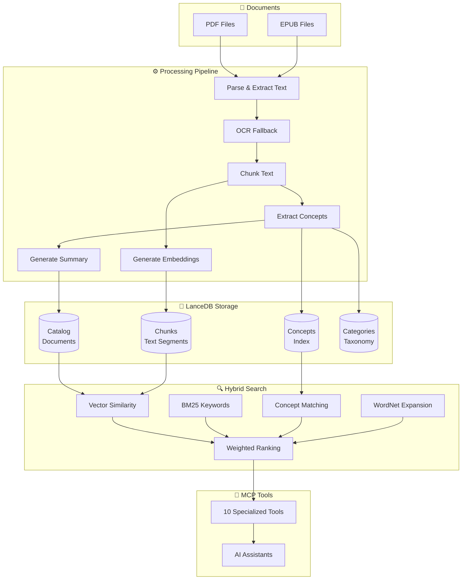

# How It Works

Concept-RAG processes your documents through a multi-stage pipeline that extracts meaning, generates embeddings, and enables powerful hybrid search.

## Pipeline Stages

### 1. Document Ingestion

- **PDF Processing**: Text extraction with layout preservation
- **EPUB Processing**: Structured content extraction from chapters
- **OCR Fallback**: Tesseract for scanned documents with no extractable text

### 2. Text Chunking

Documents are split into semantic chunks optimized for retrieval:

- Target size: ~500 tokens per chunk
- Overlap between chunks to preserve context
- Page number tracking for citations

### 3. Concept Extraction

Each document is analyzed by an LLM to extract:

- **Primary Concepts**: Core topics and themes (15-25 per document)
- **Technical Terms**: Domain-specific vocabulary
- **Related Concepts**: Secondary ideas and connections

### 4. Embedding Generation

Vector embeddings are generated for:

- Document summaries (catalog search)
- Individual chunks (content search)
- Concept definitions (semantic matching)

### 5. Hybrid Search

Queries are scored using four signals:

| Signal | Weight | Purpose |
|--------|--------|---------|
| Vector Similarity | 35% | Semantic meaning match |
| BM25 Keywords | 35% | Exact term matching |
| Concept Matching | 15% | Extracted concept overlap |
| WordNet Expansion | 15% | Synonym and hypernym matching |

Results are combined using weighted ranking for optimal retrieval accuracy.

