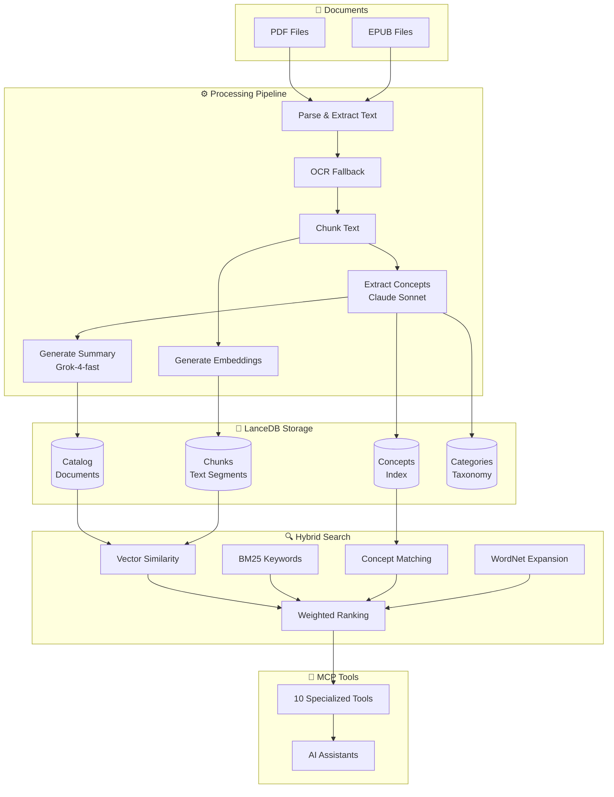

# Concept-RAG

**Search your documents by meaning, not just keywords.**

Concept-RAG is an MCP server that enables AI assistants to interact with your PDF and EPUB documents through conceptual search. It combines corpus-driven concept extraction, WordNet semantic enrichment, and multi-signal hybrid ranking for superior retrieval accuracy.

-   :material-brain:{ .lg .middle } **Conceptual Search**

    ---

    Search by meaning with 80-150+ extracted concepts per document

    [:octicons-arrow-right-24: How it works](#how-it-works)

-   :material-magnify:{ .lg .middle } **Hybrid Ranking**

    ---

    4-signal scoring: Vector + BM25 + Concepts + WordNet

    [:octicons-arrow-right-24: Architecture](architecture/README.md)

-   :material-book-multiple:{ .lg .middle } **Multi-Format**

    ---

    PDF and EPUB with OCR fallback for scanned documents

    [:octicons-arrow-right-24: Getting Started](getting-started.md)

-   :material-lightning-bolt:{ .lg .middle } **High Performance**

    ---

    80x-240x faster searches with optimized indexing

    [:octicons-arrow-right-24: API Reference](api-reference.md)

---

## How It Works

---

## Available Tools

Concept-RAG provides **10 specialized MCP tools** organized by purpose:

### Document Discovery

| Tool | Description | When to Use |
|------|-------------|-------------|
| `catalog_search` | Semantic search by topic, title, author | Finding documents about a subject |
| `category_search` | Browse by category/domain | Exploring a knowledge area |
| `list_categories` | List all categories | Discovering available topics |

### Content Search

| Tool | Description | When to Use |
|------|-------------|-------------|
| `broad_chunks_search` | Cross-document phrase search | Deep research across all documents |
| `chunks_search` | Search within a known document | Finding specific content in a source |

### Concept Analysis

| Tool | Description | When to Use |
|------|-------------|-------------|
| `concept_search` | Find chunks by concept | Tracking concept usage |
| `extract_concepts` | Export all concepts from a document | Concept mapping |
| `source_concepts` | Find documents by concept(s) | Building bibliographies |
| `concept_sources` | Per-concept source lists | Comparing coverage |
| `list_concepts_in_category` | Concepts in a category | Analyzing a domain |

[:octicons-arrow-right-24: Tool Selection Guide](tool-selection-guide.md) · [:octicons-arrow-right-24: API Reference](api-reference.md)

---

## Repository Structure

| Directory | Contents |
|-----------|----------|
| `src/` | TypeScript source code |
| `src/application/` | Composition root, dependency injection |
| `src/domain/` | Domain models, services, interfaces |
| `src/infrastructure/` | Database adapters, search, embeddings, resilience |
| `src/concepts/` | Concept extraction, indexing, query expansion |
| `src/tools/` | MCP tool implementations (10 tools) |
| `src/wordnet/` | WordNet integration and strategies |
| `docs/` | MkDocs documentation site |
| `docs/architecture/` | 52 Architecture Decision Records |
| `scripts/` | Maintenance and diagnostic utilities |
| `prompts/` | LLM prompt templates |

---

## Quick Links

-   [:material-rocket-launch: **Getting Started**](getting-started.md)

    Install and configure in under 10 minutes

-   [:material-compass: **Tool Selection Guide**](tool-selection-guide.md)

    Choose the right tool for your query

-   [:material-api: **API Reference**](api-reference.md)

    Complete MCP tool documentation

-   [:material-help-circle: **FAQ**](faq.md)

    Common questions answered

-   [:material-wrench: **Troubleshooting**](troubleshooting.md)

    Fix common issues

-   [:material-github: **GitHub**](https://github.com/m2ux/concept-rag)

    Source code and contributions

