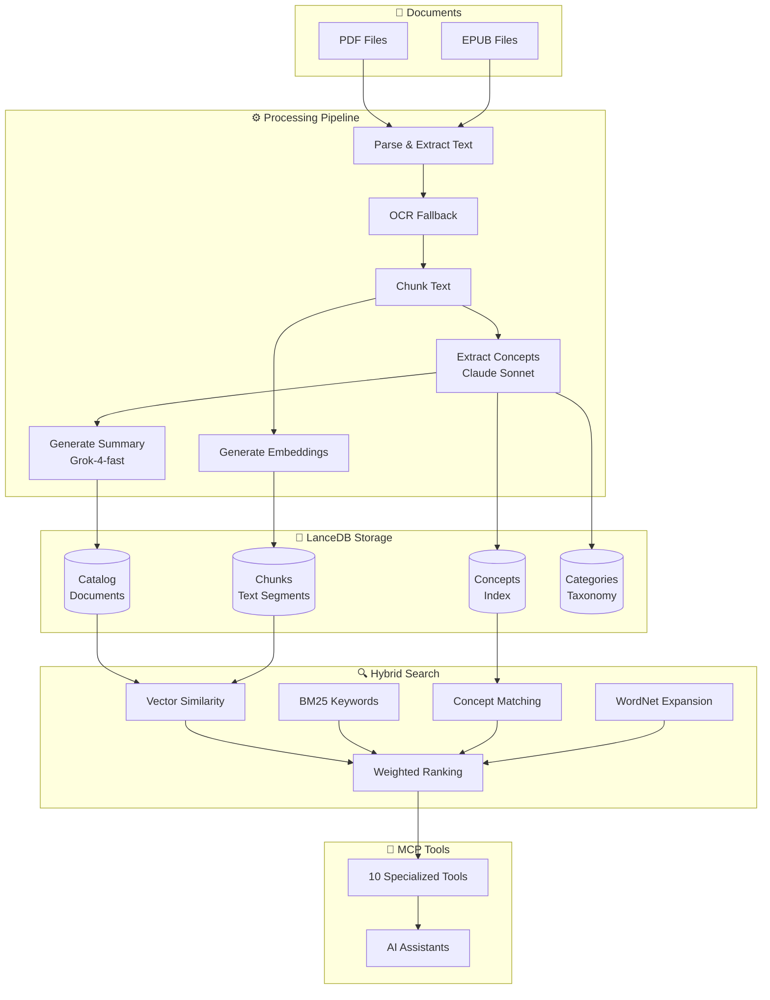

# Concept-RAG

**Search your documents by meaning, not just keywords.**

Concept-RAG is an MCP server that enables AI assistants to interact with your PDF and EPUB documents through conceptual search. It combines corpus-driven concept extraction, WordNet semantic enrichment, and multi-signal hybrid ranking for superior retrieval accuracy.

-   :material-brain:{ .lg .middle } **Conceptual Search**

    ---

    Search by meaning with 80-150+ extracted concepts per document

    [:octicons-arrow-right-24: How it works](#how-it-works)

-   :material-magnify:{ .lg .middle } **Hybrid Ranking**

    ---

    4-signal scoring: Vector + BM25 + Concepts + WordNet

    [:octicons-arrow-right-24: Architecture](architecture/README.md)

-   :material-book-multiple:{ .lg .middle } **Multi-Format**

    ---

    PDF and EPUB with OCR fallback for scanned documents

    [:octicons-arrow-right-24: Getting Started](getting-started.md)

-   :material-lightning-bolt:{ .lg .middle } **High Performance**

    ---

    80x-240x faster searches with optimized indexing

    [:octicons-arrow-right-24: API Reference](api-reference.md)

---

## How It Works

---

## Quick Links

-   [:material-rocket-launch: **Getting Started**](getting-started.md)

    Install and configure in under 10 minutes

-   [:material-compass: **Tool Selection Guide**](tool-selection-guide.md)

    Choose the right tool for your query

-   [:material-api: **API Reference**](api-reference.md)

    Complete MCP tool documentation

-   [:material-help-circle: **FAQ**](faq.md)

    Common questions answered

-   [:material-wrench: **Troubleshooting**](troubleshooting.md)

    Fix common issues

-   [:material-github: **GitHub**](https://github.com/m2ux/concept-rag)

    Source code and contributions

