# Seeding Architecture

This document describes the document seeding workflow and checkpoint recovery system.

---

## Seeding Workflow

The seeding process transforms PDF/EPUB documents into searchable chunks with extracted concepts:

```mermaid
sequenceDiagram
    participant User
    participant Seeder as hybrid_fast_seed.ts
    participant Loader as Document Loader
    participant LLM as OpenRouter API
    participant DB as LanceDB

    User->>Seeder: npx tsx hybrid_fast_seed.ts --filesdir ~/docs
    
    Seeder->>Seeder: Scan directory for PDF/EPUB files
    Seeder->>DB: Check existing documents (incremental mode)
    
    loop For each new document
        Seeder->>Loader: Load document
        Loader->>Loader: Extract text (or OCR fallback)
        Loader-->>Seeder: Text content
        
        Seeder->>Seeder: Chunk text into segments
        Seeder->>Seeder: Generate embeddings (local)
        
        Seeder->>LLM: Extract concepts (Claude Sonnet)
        LLM-->>Seeder: 80-150+ concepts
        
        Seeder->>LLM: Generate summary (Grok-4-fast)
        LLM-->>Seeder: Document summary
        
        Seeder->>DB: Store catalog entry
        Seeder->>DB: Store chunks
        Seeder->>DB: Update concepts index
    end
    
    Seeder->>DB: Rebuild indexes
    Seeder-->>User: ✅ Seeding complete
```

**Key characteristics:**

- **Incremental by default**: Only new documents are processed
- **Parallel processing**: Up to 10 documents concurrently (configurable with `--parallel`)
- **Checkpoint recovery**: Resume interrupted runs with `--resume`
- **Progress tracking**: Real-time progress bars for each stage

---

## Checkpoint & Recovery System

Seeding uses a checkpoint system to handle interruptions and detect file changes:

```mermaid
flowchart TB
    subgraph Init["🚀 Startup"]
        Start([Start Seeding])
        LoadCP[Load checkpoint.json]
        HashFiles[Hash file set<br/>FNV-1a of sorted paths]
    end

    subgraph Compare["🔍 File Set Detection"]
        CompareHash{File set hash<br/>matches checkpoint?}
        NewFiles[Detect new/removed files]
        CleanStart[Clean start:<br/>new file set detected]
    end

    subgraph Process["⚙️ Processing"]
        GetPending[Get pending documents<br/>from checkpoint]
        ProcessDoc[Process document]
        SaveCP[Save checkpoint<br/>after each doc]
        MoreDocs{More pending<br/>documents?}
    end

    subgraph Recovery["⚠️ Interruption Handling"]
        Interrupted([Process Interrupted])
        ResumeCmd([Resume with --resume])
        SkipCompleted[Skip completed docs<br/>in checkpoint]
    end

    subgraph Complete["✅ Completion"]
        AllDone[All documents processed]
        ClearCP[Clear checkpoint]
        Done([Done])
    end

    Start --> LoadCP
    LoadCP --> HashFiles
    HashFiles --> CompareHash
    
    CompareHash -->|Yes| GetPending
    CompareHash -->|No| CleanStart
    CleanStart --> NewFiles
    NewFiles --> GetPending
    
    GetPending --> ProcessDoc
    ProcessDoc --> SaveCP
    SaveCP --> MoreDocs
    
    MoreDocs -->|Yes| ProcessDoc
    MoreDocs -->|No| AllDone
    
    ProcessDoc -.->|Ctrl+C| Interrupted
    Interrupted --> ResumeCmd
    ResumeCmd --> SkipCompleted
    SkipCompleted --> GetPending
    
    AllDone --> ClearCP
    ClearCP --> Done
```

**How it works:**

1. **File set hashing**: On startup, the seeder computes a hash (FNV-1a) of all file paths in the source directory
2. **Checkpoint persistence**: After each document is processed, progress is saved to `checkpoint.json`
3. **Interruption recovery**: If interrupted (Ctrl+C), use `--resume` to continue from where you left off
4. **File set changes**: If files are added/removed, a new seeding run detects the change and processes accordingly

!!! info "Checkpoint Location"
    The checkpoint file is stored at `<dbpath>/checkpoint.json` and contains:
    
    - File set hash (FNV-1a)
    - List of completed document paths
    - Timestamp of last update

---

## Related Documentation

- [Getting Started](../getting-started.md) — Quick start guide with seeding commands
- [Stage Cache](../stage-cache-structure.md) — Intermediate caching during seeding
- [ADR-0013: Incremental Seeding](adr0013-incremental-seeding.md) — Design decision for incremental processing
- [ADR-0044: Seeding Modularization](adr0044-seeding-script-modularization.md) — Script architecture

