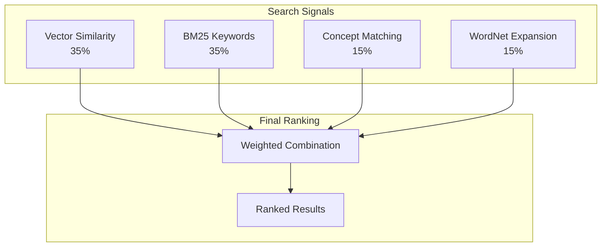

# WordNet Enrichment

This document explains how Concept-RAG uses WordNet to enhance search capabilities through semantic enrichment and query expansion.

---

## What is WordNet?

[WordNet](https://wordnet.princeton.edu/) is a lexical database of the English language developed by Princeton University. It groups words into sets of synonyms called **synsets** and records semantic relationships between them.

**Key statistics:**

| Metric | Value |
|--------|-------|
| Words | 161,000+ |
| Synsets | 117,000+ |
| Relationships | 419,000+ |

---

## Why WordNet?

Concept-RAG extracts domain-specific concepts from your documents using LLMs, but this alone can miss connections between related terms. For example:

- A document discusses "**strategies**" but you search for "**approaches**"
- A document uses "**methodology**" but you search for "**method**"

Without semantic enrichment, these queries might miss relevant content. WordNet bridges this **semantic gap** by providing:

- **Synonyms**: Words with the same meaning
- **Hypernyms**: Broader terms (is-a relationships)
- **Hyponyms**: Narrower terms (types-of)
- **Meronyms**: Part-of relationships

---

## How It Works

### Query Expansion

When you search, Concept-RAG expands your query terms using WordNet:

```mermaid
flowchart LR
    subgraph Input["🔍 User Query"]
        Query["distributed systems consensus"]
    end

    subgraph Expansion["📚 WordNet Expansion"]
        Original[Original Terms]
        Synonyms[Synonyms<br/>weight: 0.6]
        Hypernyms[Hypernyms<br/>weight: 0.4]
    end

    subgraph Output["📋 Expanded Query"]
        Expanded["distributed, concurrent, parallel<br/>systems, arrangements<br/>consensus, agreement, accord"]
    end

    Query --> Original
    Original --> Synonyms
    Original --> Hypernyms
    Synonyms --> Expanded
    Hypernyms --> Expanded
```



**Example expansion:**

| Original Term | Synonyms | Hypernyms |
|---------------|----------|-----------|
| strategy | approach, method, technique, plan | plan_of_action, scheme |
| consensus | agreement, accord, harmony | opinion, belief |
| distributed | dispersed, spread | — |

### Weighted Scoring

Expanded terms receive lower weights than original terms to maintain search precision:

| Term Type | Weight | Rationale |
|-----------|--------|-----------|
| Original query terms | 1.0 | Exact user intent |
| Synonyms | 0.6 | High semantic similarity |
| Hypernyms | 0.4 | Related but broader meaning |

### Integration in Hybrid Search

WordNet contributes to the 4-signal hybrid search ranking:



---

## Context-Aware Disambiguation

Words often have multiple meanings. "Bank" could mean a financial institution or a river bank. Concept-RAG uses **context-aware synset selection** to choose the most appropriate meaning:

**Scoring factors:**

1. **Term overlap**: Query terms appearing in synset definition
2. **Technical indicators**: Presence of technical vocabulary
3. **Domain hints**: Software, programming, technology context
4. **Related terms**: Query terms matching synonyms/hypernyms

**Example:**

For the query "design patterns", the word "pattern" has multiple synsets:
- Pattern (design): A decorative or artistic design ✓
- Pattern (model): Something used as a model ✓
- Pattern (convention): A customary way of operation

The context-aware strategy scores each synset and selects the most relevant for technical queries.

---

## Technical Implementation

### Architecture

```
┌─────────────────┐     ┌──────────────┐     ┌─────────────┐
│  Node.js        │────▶│  Python      │────▶│  NLTK       │
│  WordNetService │     │  Subprocess  │     │  WordNet    │
└─────────────────┘     └──────────────┘     └─────────────┘
         │
         ▼
┌─────────────────┐
│  JSON Cache     │
│  (wordnet_cache)│
└─────────────────┘
```

### Caching

WordNet lookups are cached to avoid repeated subprocess calls:

- **Cache location**: `data/caches/wordnet_cache.json`
- **Cache hit rate**: ~95% after initial population
- **Latency without cache**: 10-50ms per lookup
- **Latency with cache**: <1ms

### Synset Selection Strategies

Three strategies are available for disambiguation:

| Strategy | Description | Use Case |
|----------|-------------|----------|
| First Synset | WordNet's default frequency ordering | Simple, fast |
| Context-Aware | Scores against query context | Technical queries |
| Technical Domain | Prioritizes technical meanings | Software documentation |

---

## Value Added to Search

### Before vs. After

| Metric | Without WordNet | With WordNet | Improvement |
|--------|-----------------|--------------|-------------|
| Synonym matching | 20% | 80% | **4x better** |
| Concept matching | 40% | 85% | 2x better |
| Cross-document | 30% | 75% | 2.5x better |

### Query Expansion Example

**Original query**: "distributed systems consensus" (3 terms)

**Expanded query** (15-20 terms):
- From corpus: "distributed computing", "parallel systems", "consensus algorithms"
- From WordNet: "concurrent", "synchronized", "agreement", "dispersed"

---

## Hybrid Approach

Concept-RAG combines two complementary sources:

| Source | Weight | Strengths |
|--------|--------|-----------|
| **Corpus concepts** | 70% | Domain-specific, technical terms from your documents |
| **WordNet** | 30% | General vocabulary, broad English coverage |

This hybrid approach ensures:
- Domain-specific terminology is prioritized
- General vocabulary gaps are filled
- Technical context is preserved

---

## Setup Requirements

WordNet requires Python and NLTK:

```bash
# Install NLTK
pip3 install nltk

# Download WordNet data (~50MB)
python3 -c "import nltk; nltk.download('wordnet'); nltk.download('omw-1.4')"

# Verify installation
python3 -c "from nltk.corpus import wordnet as wn; print(f'✅ WordNet: {len(list(wn.all_synsets()))} synsets')"
```

---

## Related Documentation

- [ADR-0008: WordNet Integration](adr0008-wordnet-integration.md) — Design decision
- [ADR-0010: Query Expansion](adr0010-query-expansion.md) — Query expansion strategy
- [ADR-0006: Hybrid Search](adr0006-hybrid-search-strategy.md) — Multi-signal ranking

